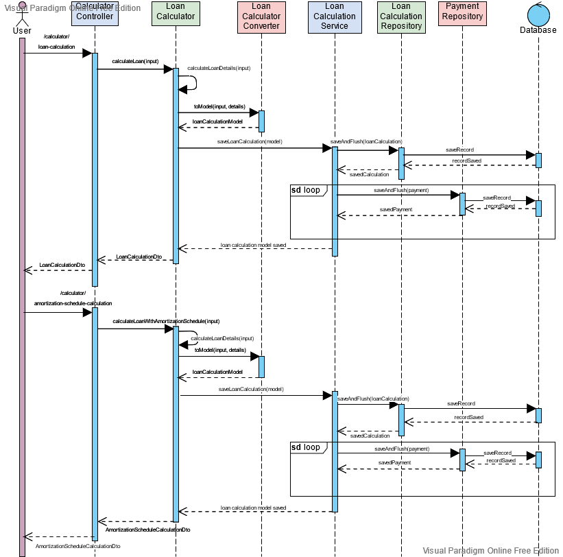

# Loan Calculator

This amortization schedule calculator creates a payment schedule for a loan with equal loan payments 
for the life of a loan. The amortization table shows how each payment is applied to the principal 
balance and the interest owed.

## UML Sequence Diagram



## API

The REST API to the loan calculator app can be described in these 2 requests:

### Generate basic loan calculation

#### Path

`POST /calculator/loan-calculation`

#### Request body

```json
{
    "amount": 1000,
    "annualInterestPercent": 5,
    "numberOfMonths": 10 
}
```

#### Response body

```json
{
    "monthlyPayment": 102.31,
    "totalInterestPaid": 23.06
}
```

### Generate amortization schedule calculation

#### Path

`POST /calculator/amortization-schedule-calculation`

#### Request body

```json
{
  "amount": 1000,
  "annualInterestPercent": 7.1,
  "numberOfMonths": 3
}
```

#### Response body

```json
{
  "monthlyPayment": 337.29,
  "totalInterestPaid": 11.86,
  "payments": [
    {
      "paymentOrder": 1,
      "paymentAmount": 337.29,
      "principalAmount": 331.37,
      "interestAmount": 5.92,
      "balanceOwed": 668.63
    },
    {
      "paymentOrder": 2,
      "paymentAmount": 337.29,
      "principalAmount": 333.33,
      "interestAmount": 3.96,
      "balanceOwed": 335.30
    },
    {
      "paymentOrder": 3,
      "paymentAmount": 337.28,
      "principalAmount": 335.30,
      "interestAmount": 1.98,
      "balanceOwed": 0.00
    }
  ]
}
```

### Postman collection requests

More examples regarding loan calculator API request can be found as Postman collection:

* [Postman collection JSON link](https://www.getpostman.com/collections/b9c83a95523598f825b0)
* [loan_calculator_postman_collection.json](postman/loan_calculator_postman_collection.json)

## Running the application locally

There are several ways to start a service on your local machine.

For a quick start, it could be done by running either of these 2 scripts:

```shell
./start-loan-calculator-with-mysql.sh
```
or
```shell
./start-loan-calculator-with-postgres.sh
```

In both scenarios, they will build fresh new docker image of loan calculator application and run it 
with corresponding database. The only difference is which database will be used, MySQL or PostgreSql.

Starting a service could also be done by executing the `main` method in the
`com.leanpay.loancalculator.LoanCalculatorApplication` class from IDE or running Gradle plugin
command:

```shell
./gradlew bootRun
```

In this case, H2 in-memory database will be used.

## Installation and Build

### Project download

Downloading Loan Calculator Spring Boot project on local machine can be done by executing command:

```shell
git clone https://github.com/marko-domic/loan-calculator.git
```

### Project build

Whole project was developed by [Gradle build tool](https://gradle.org/). Building and testing it is
done with the help of the same tool, by executing command:

```shell
./gradlew clean build
```

This command will trigger project build, all unit and integration tests of the project, which are required steps in building phase.

### Database setup

By default, Loan Calculator uses embedded
[H2 in-memory database](https://www.h2database.com/html/main.html). Changing it could be done in 2 ways:

1. By defining `DB_URL` environment variable
2. By setting `spring.datasource.url` spring configuration

Similar, DB user credentials can be set also in 2 ways:

1. By defining `DB_USERNAME` and `DB_PASSWORD` environment variables
2. By setting `spring.datasource.username` and `spring.datasource.password` spring configurations

Service is relying on relational databases only, which can be:

* [H2 in-memory database](https://www.h2database.com/html/main.html)
* [PostgreSQL](https://www.postgresql.org/)
* [MySQL](https://www.mysql.com/)

If PostgreSQL database is used, it is required to set another property for Flyway database
migrations, because of its different SQL syntax. It could be done in one of these 2 ways:

1. By setting `FLYWAY_LOCATIONS` environment variable to `classpath:postgresql/db/migration`
   (`FLYWAY_LOCATIONS=classpath:postgresql/db/migration`)
2. By setting `spring.flyway.locations` spring configuration to `classpath:postgresql/db/migration`

### Build Docker image

Creating Docker image of a service can be done by executing command:

```shell
./gradlew bootBuildImage --imageName=loan-calculator
```

## Technology Stack

### Data

|                 Technology                                               |                              Description                        |
|--------------------------------------------------------------------------|-----------------------------------------------------------------|
|<a href="https://flywaydb.org/">Flyway</a>                                |Version control for database                                     |
|<a href="https://www.postgresql.org/">PostgreSQL</a>                      |Open-Source Object-Relational Database System                    |
|<a href="https://www.mysql.com/">MySQL</a>                                |Open-Source Relational Database Management System                |
|<a href="https://www.h2database.com/html/main.html">H2 Database Engine</a>|Java SQL database. Embedded and server modes; in-memory databases|

### Server

|                                            Technology                                               |                              Description                                     |
|-----------------------------------------------------------------------------------------------------|------------------------------------------------------------------------------|
|<a href="http://www.oracle.com/technetwork/java/javase/downloads/jdk8-downloads-2133151.html">JDK</a>|Java™ Platform, Standard Edition Development Kit                              |
|<a href="https://spring.io/projects/spring-boot">Spring Boot</a>                                     |Framework to ease the bootstrapping and development of new Spring Applications|
|<a href="https://gradle.org/">Gradle</a>                                                             |Build Tool                                                                    |

###  Libraries and Plugins

* [Lombok](https://projectlombok.org/) - Never write another getter or equals method again, with one 
  annotation your class has a fully featured builder, Automate your logging variables, and much more.
* [Mockito](https://site.mockito.org/) - Open source testing framework for Java which allows the 
  creation of test double objects (mock objects) in automated unit tests for the purpose of 
  test-driven development (TDD) or behavior-driven development (BDD).
* [WireMock](http://wiremock.org/) - Simulator for HTTP-based APIs. It constructs a HTTP server that 
  we could connect to as we would to an actual web service. When a WireMock server is in action, we 
  can set up expectations, call the service, and then verify its behaviors.

### Other

* [git](https://git-scm.com/) - Free and Open-Source distributed version control system.
* [Docker](https://www.docker.com/) - A set of platform as a service products that use OS-level 
  virtualization to deliver software in packages called containers.
